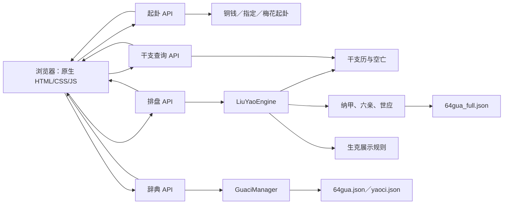

# 项目架构

## 组件与主链路

前端只负责采集输入、调用 API 和渲染结果，不复制六十四卦映射或核心算法。
起卦响应作为排盘请求的唯一输入，排盘引擎统一组装本卦、变卦和各爻信息。

## 后端边界

| 层 | 目录 | 职责 |
|---|---|---|
| 应用 | `backend/main.py` | 应用工厂、路由装配、静态页面、CORS、健康检查 |
| API | `backend/api/` | HTTP 契约、错误边界和业务编排 |
| 模型 | `backend/models/` | 严格输入校验与响应结构 |
| 核心 | `backend/core/` | 起卦、历法、纳甲、空亡、生克和排盘 |
| 数据 | `backend/data/` | 六十四卦结构、卦爻辞及可复现生成器 |
| 前端 | `frontend/` | 同源单页交互和结果展示 |

API 层不得返回内部异常文本；核心层接收已经验证的领域值，并通过公开方法
组合结果，不使用运行时 monkey patch 或静默降级。

## 数据与规则决策

1. `64gua_full.json` 是排盘运行时的六十四卦结构与纳甲数据源，生成器结果
   必须与该文件一致。
2. `64gua.json` 和 `yaoci.json` 是卦辞、爻辞数据源，由后端按卦名查询。
3. 今日及自定义本地日期时间到干支历的转换统一委托固定版本的
   `lunar-python`，月柱按节气切换，日柱采用 `sect=2`。
4. 生克、合冲筛选明确属于项目展示规则；没有专家校勘证据时，不扩展为
   “唯一传统标准”。
5. 依赖由 `requirements.lock` 与 `requirements-dev.lock` 固定并校验哈希，
   CI 使用开发锁文件复现环境。

## 运行与安全

- 默认绑定回环地址且不启用 CORS；跨域只能通过显式来源白名单开启。
- Windows 管理脚本将 PID、启动时间和日志写入 `runtime/`，停止前同时验证
  PID 与启动时间，降低误杀风险。
- `reload` 仅供开发使用，默认关闭。
- `/healthz` 是启动就绪和外部存活检查的稳定入口。
- 静态文件挂载在业务与健康路由之后，避免覆盖 API。

## 验证边界

- 单元和 API 测试覆盖历法样本、起卦概率、严格输入、辞典与安全错误响应。
- 数据回归覆盖 64 卦及全部 4,096 种本卦/动爻组合。
- 前端契约测试加 Node.js 语法检查，关键流程另以真实 Chromium 验收。
- CI 执行 Ruff、Python 编译、JavaScript 语法和完整 pytest 测试。
